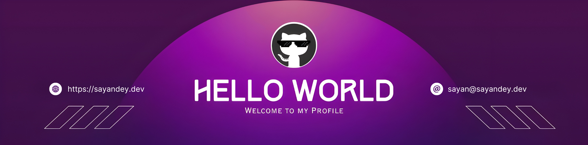

<!--Banner-->

<!--Night Owl image-->

  

<!--Header Name-->
#  ɪ'ᴍ ꜱᴀʏᴀɴ! 
*Digital Craftsman (Developer / Blogger)*
  

<!--Start Intro-->               

I am a self-taught Developer and JavaScript Enthusiast from Kolkata. Who loves modern web technology, web stuff creation, and interactive coding layouts.

- ✨ Student of life :)
- 🌱 I’m currently learning many things, I believe that everyday is a learning opportunity.
- 🔥 Currently working on a tool based project [Hosting Checker](https://hostingchecker.org/).
- ✍ I write technical blogs, You can visit my blog site at [Bloggingmetrics](https://bloggingmetrics.com/).
- ❤️ Contributing to Open Source.
- 💻 Visit my [Portfolio](https://sayandey.dev) for more details about me.
<!--End Intro-->

<!--Profile Count Badge-->

  

---
 

<!--Languages and Tools Section-->       
<h2 align="center">⚡ Lᴀɴɢᴜᴀɢᴇs ᴀɴᴅ Tᴏᴏʟs ⚡</h2> 

 

<!--Github stats Table--> 
<h2 align="center">📊 Gɪᴛʜᴜʙ Sᴛᴀᴛs 📊</h2>

<table width="100%">
  <tr>
    <td width="50%">
      <h3 align="center"><strong>Gɪᴛʜᴜʙ Sᴛᴀᴛs</strong></h3>
      

        
      

    </td>
    <td width="50%">
      <h3 align="center"><strong>Sᴛʀᴇᴀᴋ Sᴛᴀᴛs</strong></h3>
      

        
      

    </td>
  </tr>
  <tr>
    <td width="50%">
      <h3 align="center"><strong>Lᴀᴛᴇsᴛ Pʀᴏᴊᴇᴄᴛ</strong></h3>
      

        
      

    </td>
    <td width="50%">
      <h3 align="center"><strong>Tᴏᴘ Cᴏɴᴛʀɪʙᴜᴛɪᴏɴs</strong></h3>
      

        
      

    </td>
  </tr>
</table>
 

<!--Contribution Graph-->
<h2 align="center">📈 Cᴏɴᴛʀɪʙᴜᴛɪᴏɴ Gʀᴀᴘʜ 📈</h2>

    

<!--Contact Section--> 

<h2 align="center">🤝 Cᴏɴɴᴇᴄᴛ Wɪᴛʜ Mᴇ 🤝 </h2>

 
  

 

<!--Footer--> 

  

